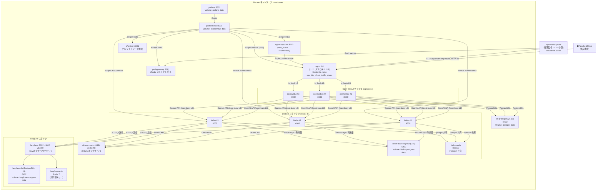

# システム構成図

## 概要

OpenWebUI の負荷試験環境。JMeter による負荷生成・Nginx によるロードバランシング・LiteLLM による LLM プロキシ・Langfuse による LLM オブザーバビリティ・Prometheus/Grafana による監視を組み合わせたシステム。

## コンポーネント構成図



## サービス一覧

| サービス | イメージ / Dockerfile | ホストポート | 役割 |
|---|---|---|---|
| **nginx** | `Dockerfile.nginx` (nginx + VTS モジュール) | `80` | リバースプロキシ / ip_hash ロードバランサ |
| **openwebui** × 3 | `ghcr.io/open-webui/open-webui:main` | — | チャット UI・API サーバ（3レプリカ） |
| **db** | `postgres:15` | — | OpenWebUI 用 PostgreSQL |
| **litellm** × 3 | `ghcr.io/berriai/litellm-database:main-v1.72.6-stable` | `4000` | LLM プロキシ・モデルルーティング・Langfuse 連携（3レプリカ） |
| **litellm-db** | `postgres:15` | — | LiteLLM 用 PostgreSQL（Virtual Keys・利用量管理） |
| **litellm-redis** | `redis:7-alpine` | — | LiteLLM 複数インスタンス間 rpm/tpm 状態共有 |
| **ollama-mock** | `Dockerfile` (Python/Gunicorn) | `11434` | Ollama API モックサーバ |
| **langfuse** | `langfuse/langfuse:2.84.0` | `3002` | LLM トレース・オブザーバビリティ UI |
| **langfuse-db** | `postgres:15` | — | Langfuse 用 PostgreSQL |
| **langfuse-redis** | `redis:7-alpine` | — | Langfuse 非同期処理キュー |
| **openwebui-probe** | `Dockerfile.probe` (Python) | — | TTFT・死活監視 → Pushgateway |
| **cadvisor** | `gcr.io/cadvisor/cadvisor` | `8081` | コンテナ CPU/MEM メトリクス収集 |
| **nginx-exporter** | `nginx/nginx-prometheus-exporter` | `9113` | nginx stub_status → Prometheus |
| **pushgateway** | `prom/pushgateway` | `9091` | Probe からのメトリクス受信 |
| **prometheus** | `prom/prometheus` | `9090` | メトリクス収集・保存（30日保持） |
| **grafana** | `grafana/grafana` | `3001` | ダッシュボード可視化 |

## Prometheus スクレイプ設定

| job | ターゲット | 収集内容 |
|---|---|---|
| `cadvisor` | `cadvisor:8080` | コンテナリソース使用量 |
| `nginx-exporter` | `nginx-exporter:9113` | Nginx 接続数・リクエスト数 |
| `nginx-vts` | `nginx:80/metrics` | VTS によるバーチャルホスト別トラフィック |
| `pushgateway` | `pushgateway:9091` | Probe の TTFT・レスポンス時間・成功率 |
| `litellm` | `litellm:4000/metrics` | LiteLLM リクエスト数・レイテンシ・モデル別集計 |

## データフロー

```
[JMeter] ──HTTP──▶ [nginx :80] ──ip_hash LB──▶ [openwebui ×3] ──OpenAI API──▶ [litellm ×3 (least-busy LB)]
                                                       │                               │
                                                       └──PostgreSQL──▶ [db]           ├──Ollama API──▶ [ollama-mock]
                                                                                       ├──トレース────▶ [langfuse :3002]
                                                                                       ├──Virtual Keys─▶ [litellm-db]
                                                                                       └──rpm/tpm──────▶ [litellm-redis]

[openwebui-probe] ──HTTP──▶ [nginx] ──▶ [openwebui] ──▶ [litellm] ──▶ [ollama-mock]
        │
        └──Push──▶ [pushgateway] ──scrape──▶ [prometheus] ──▶ [grafana]

[cadvisor] ──scrape──▶ [prometheus]
[nginx-exporter] ──scrape──▶ [prometheus]
[nginx VTS /metrics] ──scrape──▶ [prometheus]
[litellm ×3 /metrics] ──scrape──▶ [prometheus]
```

## Langfuse 初期セットアップ手順

Langfuse を初めて起動した後に以下の手順でキーを取得し、LiteLLM に設定する。

1. `http://localhost:3002` にアクセスしてアカウントを作成
2. プロジェクトを作成 → **Settings > API Keys** で `pk-lf-...` / `sk-lf-...` を取得
3. `docker-compose.yml` の `litellm` サービスの環境変数を更新:
   ```yaml
   - LANGFUSE_PUBLIC_KEY=pk-lf-<取得した値>
   - LANGFUSE_SECRET_KEY=sk-lf-<取得した値>
   ```
4. `docker compose restart litellm` で反映

> **本番環境では** `NEXTAUTH_SECRET` と `SALT` を必ずランダムな文字列に変更すること。

## ネットワーク

すべてのコンテナは `monitor-net`（bridge ドライバ）に所属。  
外部からのアクセスは Nginx (:80)・Langfuse (:3002)・LiteLLM (:4000) のみ公開。openwebui は直接公開なし。
